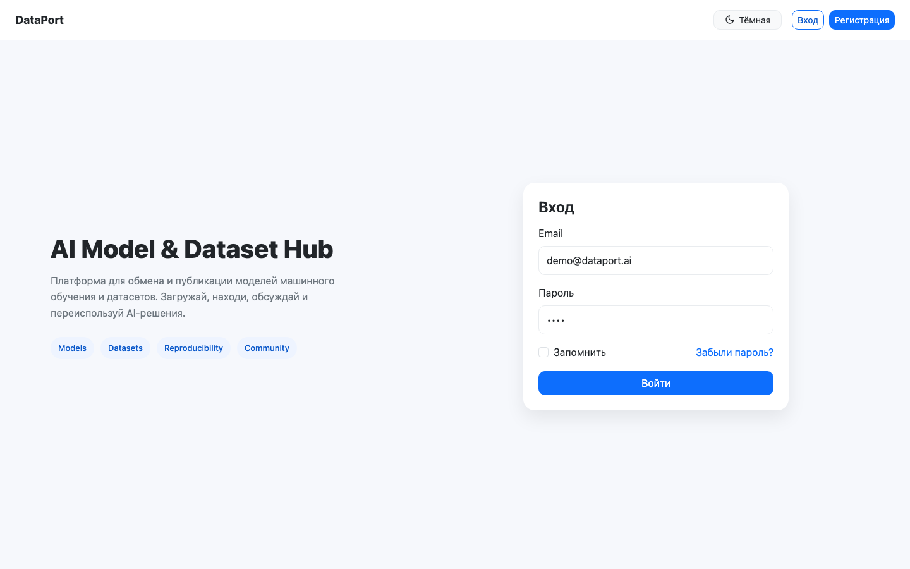
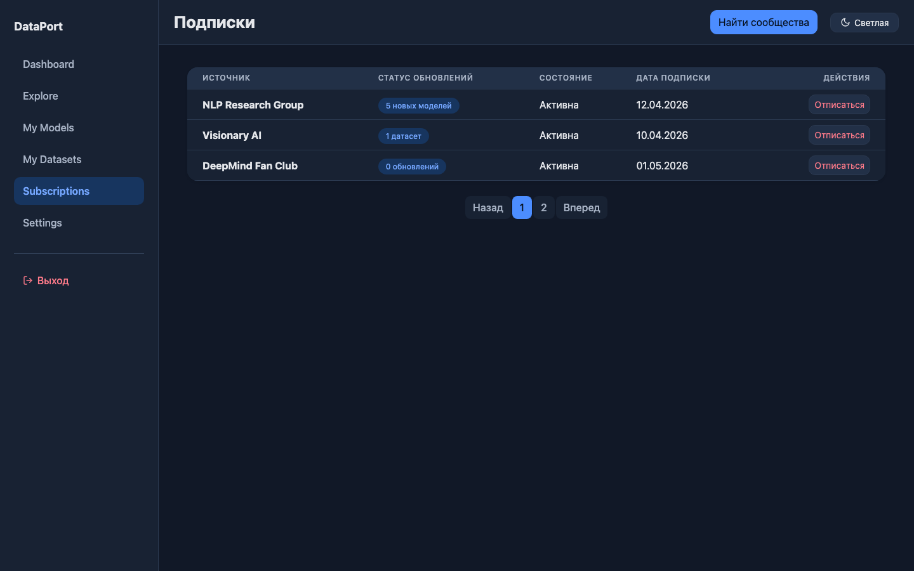

# Домашняя работа 5: npm и Vue

Приложение DataPort перенесено на Vue 3 без изменения предметной области и визуального стиля предыдущих работ. Проект запускается через npm, использует Vue Router для страниц и JSON Server для мокового API.

## Запуск

```bash
npm install
npm run start
```

После запуска приложение доступно по адресу `http://localhost:5173/`.

Тестовый аккаунт:

```text
demo@dataport.ai
demo
```

## Компоненты

- `AppShell`, `AppSidebar`, `AppTopbar` формируют общий интерфейс приложения.
- `AuthLayout` используется страницами входа и регистрации.
- `ResourceCard` и `CollectionTable` выводят модели и датасеты из API.
- `UploadModal`, `ThemeToggle`, `SvgIcon` переиспользуются в представлениях.
- Представления находятся в `src/views`, состояние и запросы к API вынесены в `src/store.js`, `src/session.js` и `src/api.js`.

## Скриншоты

### Компоненты авторизации



### Компоненты подписок и тёмной темы


