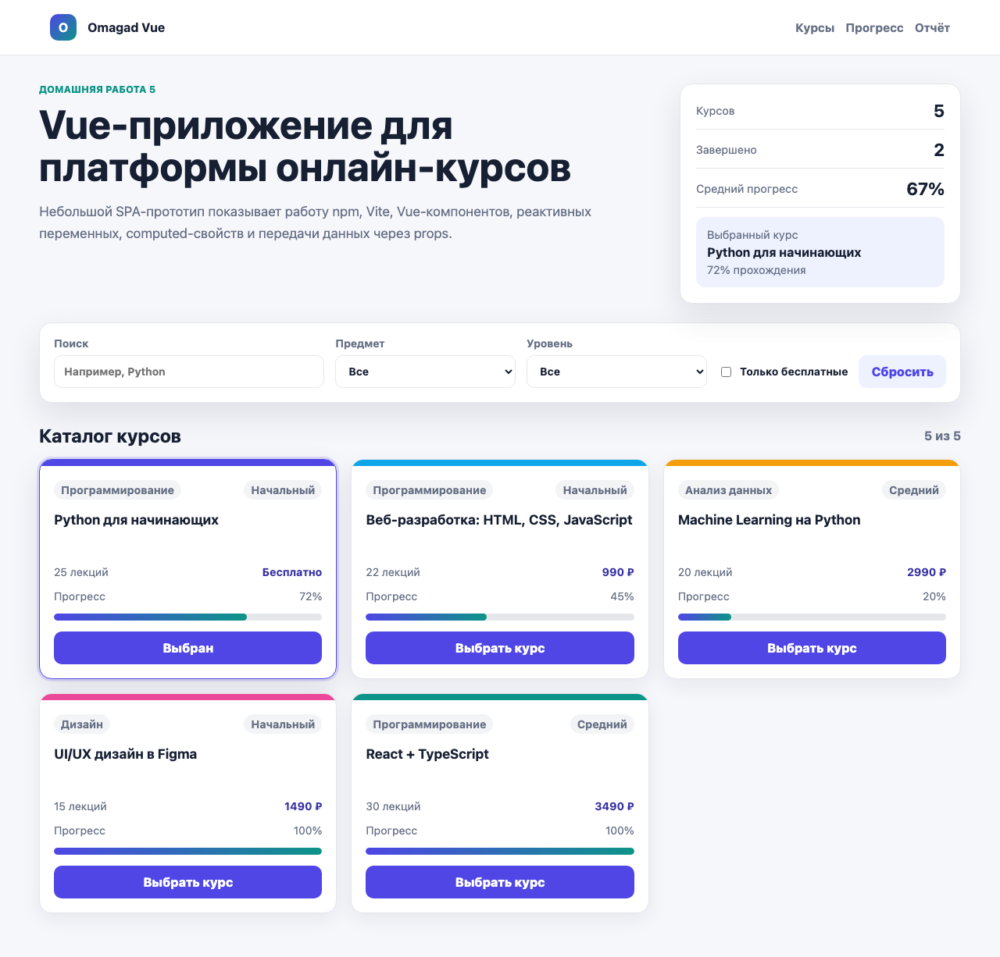
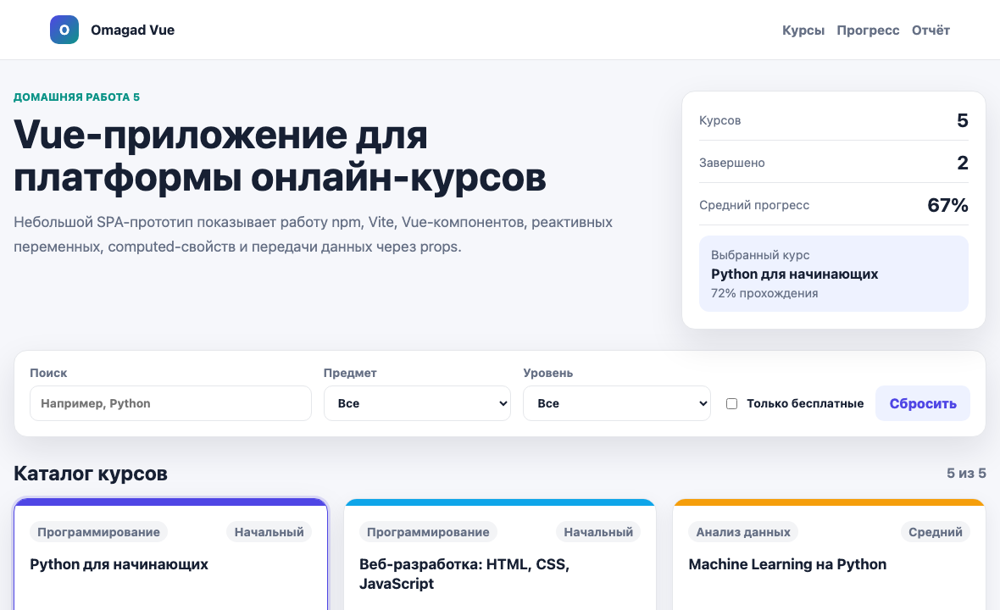

# Домашняя работа 5

Тема: основы работы с менеджером зависимостей npm и запуск Vue-проекта.

## Что реализовано

- Проект на Vue 3, собранный через Vite.
- `package.json` с npm-скриптами `dev`, `build`, `preview`.
- Компонентная структура приложения:
  - `AppHeader.vue` - шапка приложения;
  - `CourseFilters.vue` - фильтры каталога;
  - `CourseCard.vue` - карточка курса;
  - `ProgressPanel.vue` - статистика прогресса.
- Реактивные переменные через `ref`.
- Производные значения через `computed`.
- Передача данных в компоненты через `props`.
- Отправка событий из дочерних компонентов через `emit`.
- Двусторонняя привязка с компонентом фильтров через `v-model`.

## Команды npm

```bash
npm install
npm run dev
npm run build
npm run preview
```

Назначение команд:

- `npm install` устанавливает зависимости из `package.json`.
- `npm run dev` запускает dev-сервер Vite для разработки.
- `npm run build` собирает production-версию проекта в папку `dist`.
- `npm run preview` запускает локальный просмотр production-сборки.

## Где находится код

- Точка входа: `src/main.js`.
- Корневой компонент: `src/App.vue`.
- Данные курсов: `src/data/courses.js`.
- Компоненты: `src/components`.
- Стили: `src/styles.css`.

## Что показать на защите

1. Открыть `package.json` и объяснить, что такое `dependencies` и `scripts`.
2. Запустить `npm install`, затем `npm run dev`.
3. Показать, что приложение открывается в браузере.
4. Показать фильтрацию курсов по поиску, предмету, уровню и бесплатным курсам.
5. Открыть компоненты и объяснить:
   - `props` принимают данные от родителя;
   - `emit` отправляет событие родителю;
   - `computed` пересчитывает список курсов и статистику;
   - `v-for` отрисовывает массив курсов;
   - `v-if` показывает пустое состояние, если фильтры ничего не нашли.

## Скриншоты

Скриншоты интерфейса и компонентов находятся в папке `screenshots`.






